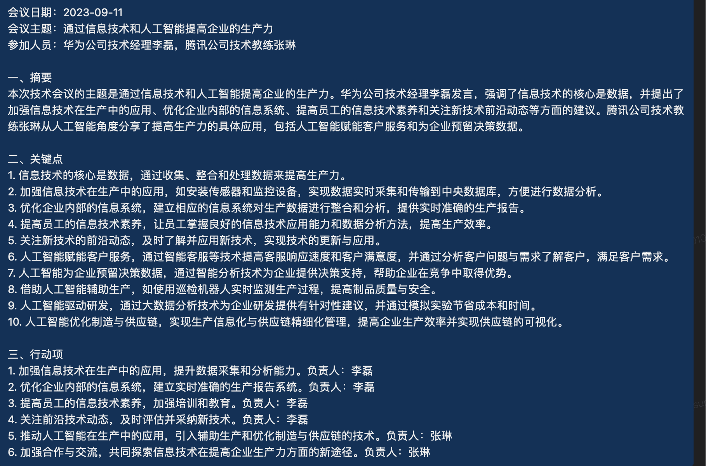
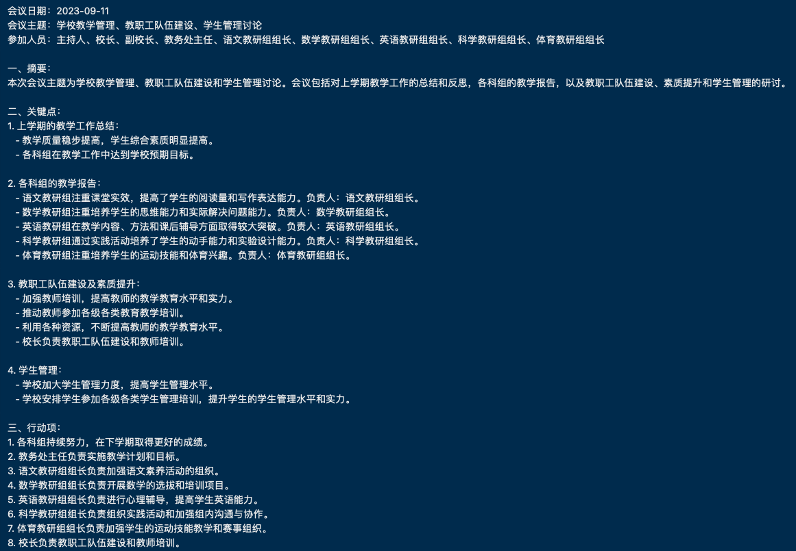

# 使用智能会议纪要服务

本文介绍如何为你的项目部署智能会议纪要服务。

## 准备工作

### Agora RTC

确保你有[声网](www.shengwang.cn)账号，并且在[声网控制台](https://console.agora.io/)中创建了一个项目。然后将`smart_meeting_minutes_go_app/manifest.json`中的`<AGORA_RTC_APP_ID>`替换为你自己的 _App ID_。

### 讯飞语音转写

本应用使用[讯飞语音转写](https://www.xfyun.cn/services/fast_lfasr)将音频转写为文本。你需要注册一个账号并在[讯飞控制台](https://console.xfyun.cn/)中创建一个应用。然后将`smart_meeting_minutes_go_app/manifest.json`中的`<IFLY_APP_ID>`、`<IFLY_API_KEY>`和`<IFLY_API_SECRET>`替换为你自己的 _App ID_、 _Api Key_ 和 _Secret Key_。

### OpenAI/Azure GPT

本应用使用GPT生成会议纪要。你需要注册一个账号并在[OpenAI](https://openai.com/)或[Azure AI](https://azure.microsoft.com/en-us/services/cognitive-services/text-analytics/)中创建一个应用。然后将`smart_meeting_minutes_go_app/manifest.json`中的`<OPENAI_API_KEY>`替换为你自己的 _OpenAI Api Key_ ，或将`<AZURE_API_KEY>`、`<AZURE_DEPLOYMENT_ID>`、`<AZURE_RESOURCE_NAME>`和`<AZURE_API_VERSION>`替换为你自己的 _Azure Api Key_、_Azure Deployment Id_、_Azure Resource Name_ 和 _Azure Api Version_。

## 使用给定dockerfile构建和部署

- 首先构建镜像 `smart_meeting_minutes_go`.

- _你可以使用 `all_in_one.dockerfile` 构建镜像，命令如下：_

  ```bash
  cd out/linux/x64/test/rte_runtime/dev/go/smart_meeting_minutes_go
  docker build -t smart_meeting_minutes_go:$version$ -f <RTE_SRC>/test/rte_runtime/dev/go/smart_meeting_minutes_go/dockerfile/all_in_one.dockerfile .
  ```

  _你可以给镜像打上标签。_

  ```bash
  docker tag smart_meeting_minutes_go:$version$ hub-master.agoralab.co/server/app/smart_meeting_minutes_go:$version$
  ```

  _你可以将镜像推送到你的docker hub。_

  ```bash
  docker push hub-master.agoralab.co/server/app/smart_meeting_minutes_go:$version$
  ```

- 然后运行镜像 `smart_meeting_minutes_go`.

  ```bash
  docker run -p 8001:8001 smart_meeting_minutes_go:$version$
  ```

## Api参考

你可以使用以下api与应用交互。

| Method | Path                                | Description                                                           |
| ------ | ----------------------------------- | --------------------------------------------------------------------- |
| POST   | /0/gateway_group/gateway/start_sync | 开启会议纪要服务并且直到会议结束才会收到响应 |
| POST   | /0/gateway_group/gateway/start      | 开启会议纪要服务并且立马返回                                          |
| POST   | /0/gateway_group/gateway/stop       | 停止会议纪要服务                                                      |

### 同步模式开启会议纪要服务

#### 准备工作

此Api适用于在类似于阿里云函数计算这样的serverless平台上部署服务的场景。应用程序在会议结束之前不会响应此请求。会议纪要的结果将会被发送到webhook url。要通知应用程序会议已经结束，你需要调用停止api，停止api将通过消息中间件向应用程序发送消息，然后应用程序将接收消息并停止会议。我们使用`RTM`作为消息中间件，所以你需要在[声网控制台](https://console.agora.io/)中创建一个RTM应用，然后使用RTM的 _app id_ 、_uid_ 和 _token_ 来请求api。

你也可以设置最大空闲时间（以秒为单位），如果频道内空闲（无任何人加入）时间超过最大空闲时间，应用程序将停止会议并将结果发送到webhook url。

#### 示例

```bash
curl --location 'https://hostname/0/gateway_group/gateway/start_sync' \
--header 'X-Fc-Invocation-Type: Async' \
--header 'Content-Type: application/json' \
--data '{
    "agoraRtcConfig": {
        "channelName": "smt_meeting",
        "token": "",
        "uid": "",
        "encryption": {
            "mode": 0,
            "secret": "",
            "salt": ""
        }
    },
    "agoraRtmConfig": {
        "appId": "4c24d8fc36554a258402f08e96d30026",
        "uid": "smt_meeting_service",
        "token": "xxx"
    },
    "ossConfig": {
        "endpoint": "oss-cn-shanghai.aliyuncs.com",
        "accessKeyId": "xxx",
        "accessKeySecret": "xxx",
        "bucketName": "rte-platform",
        "objectName": "rte_app/smart_meeting_minutes/test_dir/test.txt"
    },
    "recognizeConfig": {
        "language": ""
    },
    "callbackUrl": "https://webhook.site/70d83d2c-a260-4866-938b-db275cf53c2f",
    "taskId": "aab",
    "maxIdleTime": 100
}'
```

#### 请求参数

| Name           | Fields           | SubField | Must | Type   | Description                                               |
| -------------- | --------------- | -------- | ---- | ------ | --------------------------------------------------------- |
| agoraRtcConfig | channelName     |          | Y    | string | RTC频道名                           |
|                | token           |          | N    | string | 用于加入频道的token                        |
|                | uid             |          | N    | string | 用于加入频道拉流的机器人uid                       |
|                | encryption      | mode     | N    | int    | 媒体流加密模式                          |
|                |                 | secret   | N    | string | 媒体流加密密钥                                   |
|                |                 | salt     | N    | string | 媒体流加密盐                                     |
| agoraRtmConfig | appId           |          | Y    | string | 声网RTM app id                                   |
|                | uid             |          | Y    | string | 声网RTM uid                                      |
|                | token           |          | Y    | string | 声网RTM token                                    |
| ossConfig      | endpoint        |          | Y    | string | OSS endpoint                                       |
|                | accessKeyId     |          | Y    | string | OSS access key                                  |
|                | accessKeySecret |          | Y    | string | OSS access key secret                              |
|                | bucketName      |          | Y    | string | OSS bucket name                                    |
|                | objectName      |          | Y    | string | OSS object name                                    |
| callbackUrl    |                 |          | Y    | string | 用于接收结果的webhook url                             |
| taskId         |                 |          | Y    | string | 此次请求的id（唯一）                       |
| maxIdleTime    |                 |          | N    | int    | 最大空闲等待时间（默认30s） |
| gptConfig      | model           |          | N    | string | GPT模型名称                                          |
|                | temperature     |          | N    | float  | GPT temperature                                    |
|                | maxTokens       |          | N    | float  | GPT最大token数                                     |

### 异步模式开启会议纪要服务

如果你不打算在serverless平台上部署应用程序，意味着你可以向同一应用程序实例发送开始和停止请求，你可以使用此api。应用程序将立即返回，当收到停止请求后，结果将发送到回调url。

#### 示例

```bash
curl --location 'https://hostname/0/gateway_group/gateway/start' \
--header 'Content-Type: application/json' \
--data '{
    "agoraRtcConfig": {
        "channelName": "smt_meeting",
        "token": "",
        "uid": "",
        "encryption": {
            "mode": 0,
            "secret": "",
            "salt": ""
        }
    },
    "ossConfig": {
        "endpoint": "oss-cn-shanghai.aliyuncs.com",
        "accessKeyId": "xxx",
        "accessKeySecret": "xxx",
        "bucketName": "rte-platform",
        "objectName": "rte_app/smart_meeting_minutes/test_dir/test.txt"
    },
    "recognizeConfig": {
        "language": ""
    },
    "callbackUrl": "https://webhook.site/70d83d2c-a260-4866-938b-db275cf53c2f",
    "taskId": "aab",
    "maxIdleTime": 100
}'
```

#### 请求参数

| Name           | Fields           | SubField | Must | Type   | Description                                               |
| -------------- | --------------- | -------- | ---- | ------ | --------------------------------------------------------- |
| agoraRtcConfig | channelName     |          | Y    | string | RTC频道名                           |
|                | token           |          | N    | string | 用于加入频道的token                        |
|                | uid             |          | N    | string | 用于加入频道拉流的机器人uid                       |
|                | encryption      | mode     | N    | int    | 媒体流加密模式                          |
|                |                 | secret   | N    | string | 媒体流加密密钥                                   |
|                |                 | salt     | N    | string | 媒体流加密盐                                     |
| ossConfig      | endpoint        |          | Y    | string | OSS endpoint                                       |
|                | accessKeyId     |          | Y    | string | OSS access key                                  |
|                | accessKeySecret |          | Y    | string | OSS access key secret                              |
|                | bucketName      |          | Y    | string | OSS bucket name                                    |
|                | objectName      |          | Y    | string | OSS object name                                    |
| callbackUrl    |                 |          | Y    | string | 用于接收结果的webhook url                             |
| taskId         |                 |          | Y    | string | 此次请求的id（唯一）                       |
| maxIdleTime    |                 |          | N    | int    | 最大空闲等待时间（默认30s） |
| gptConfig      | model           |          | N    | string | GPT模型名称                                          |
|                | temperature     |          | N    | float  | GPT temperature                                    |
|                | maxTokens       |          | N    | float  | GPT最大token数                                     |

### 停止会议纪要服务

如果你可以向正在运行的应用程序实例发送停止请求，你可以使用此api。应用程序将停止会议纪要服务并将结果发送到webhook url。

#### 示例

```bash
curl --location 'https://hostname/0/gateway_group/gateway/stop' \
--header 'Content-Type: application/json' \
--data '{
    "taskId": "aab"
}'
```

#### 请求参数

| Name   | Must | Type   | Description                        |
| ------ | ---- | ------ | ---------------------------------- |
| taskId | Y    | string | start请求时携带的唯一的taskId |

如果你不能向正在运行的应用程序实例发送停止请求，你可以部署另一个函数来向消息中间件（RTM）发送停止请求。正在运行的应用程序实例将接收消息并停止会议纪要服务。你可以使用以下api向消息中间件（RTM）发送停止请求。

### 通过RTM发送停止请求

#### 示例

```bash

curl --location 'https://smart-mtes-stop-rte-test-pmkrogjnwb.ap-southeast-1.fcapp.run/0/gateway_group/gateway/stop' \
--header 'Content-Type: application/json' \
--data '{
    "taskId": "aab",
    "agoraRtmConfig": {
        "uid": "smt_meeting_service_zzz",
        "token": "xxx",
        "appId": "4c24d8fc36554a258402f08e96d30026"
    }
}'

```

#### 请求参数

| Name           | Fields | Must | Type   | Description                        |
| -------------- | ------ | ---- | ------ | ---------------------------------- |
| agoraRtmConfig | appId  | Y    | string | RTM app id            |
|                | uid    | Y    | string | RTM uid               |
|                | token  | Y    | string | RTM token            |
| taskId         |        | Y    | string | start请求时携带的唯一的taskId |

## 效果展示

下面是应用程序生成的会议纪要的一些示例。

|      技术研讨会        |         学校会议        |
| :------------------------------------------: | :------------------------------------------: |
|  |  |

## Demo

你可以使用AVC ([Agora Video Call](https://avc.agora.io/webapp/home))客户端进入会议，房间号前缀为AG-MM，例如：AG-MM1。然后点击开启云端录制，会议纪要也会同时开启。关闭云端录制也会关闭会议纪要。然后会议纪要将会生成并通过微信发送给所有加入会议的用户。
